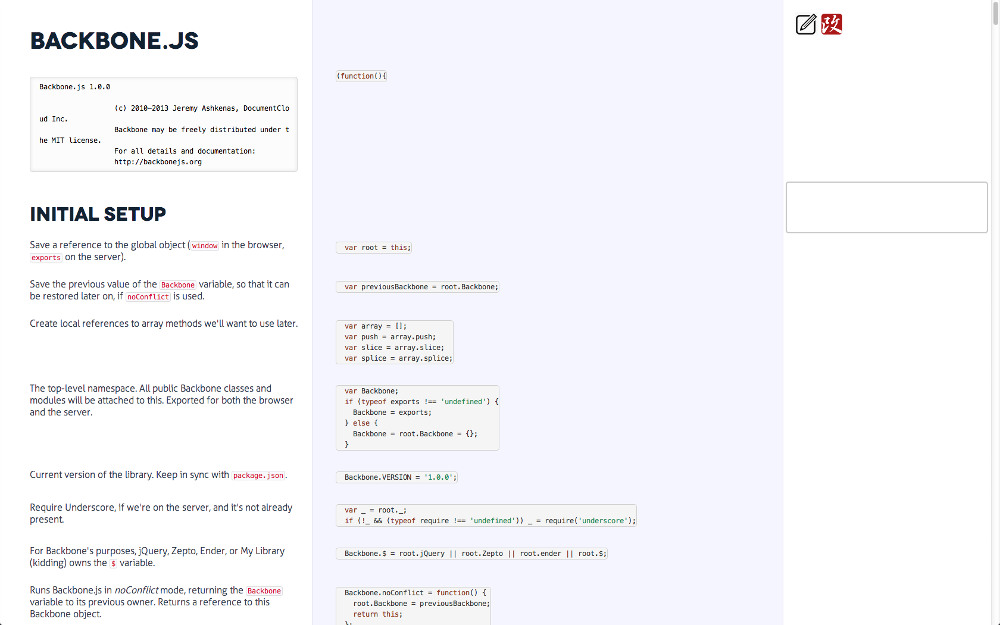
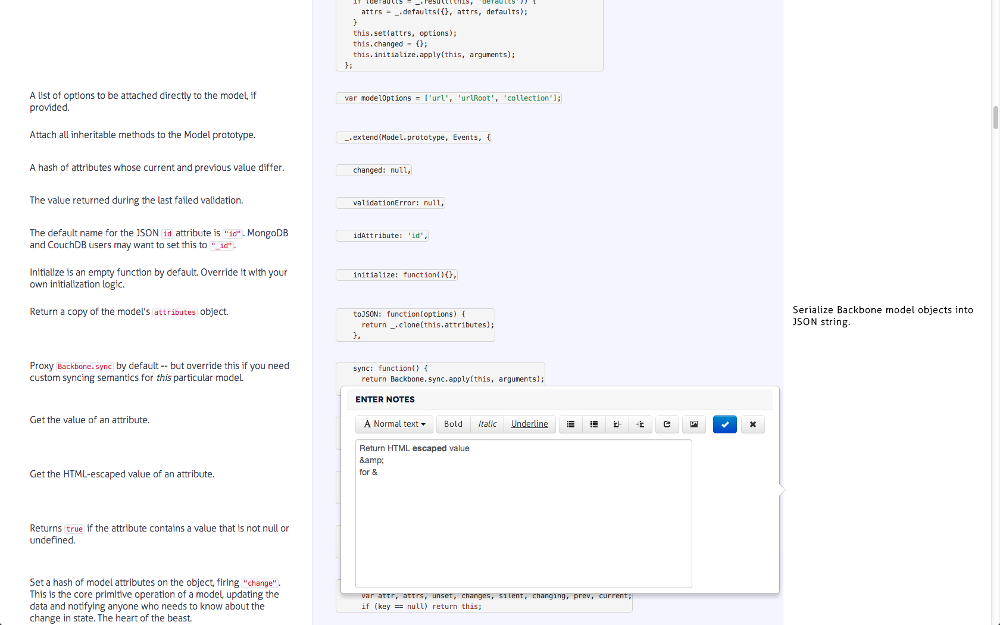
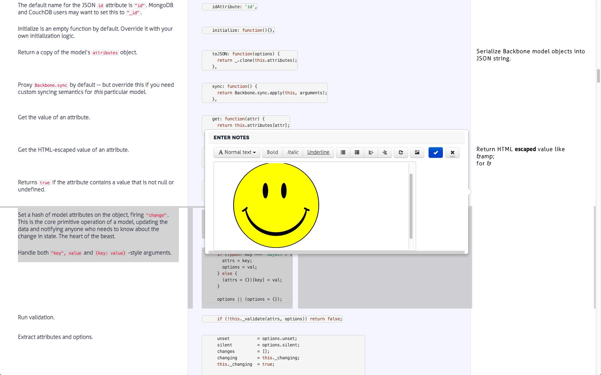
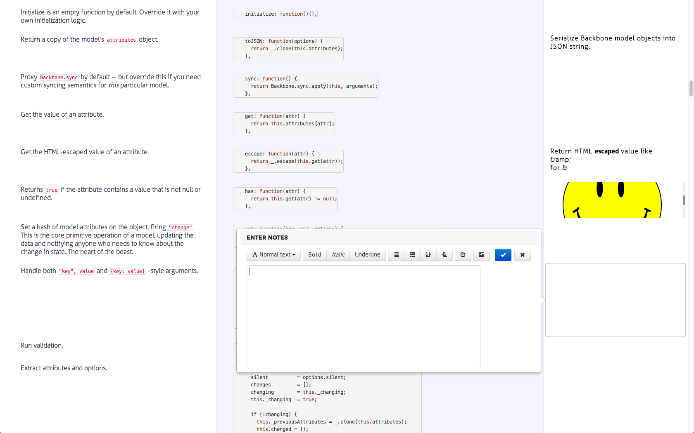

edocco version 0.0.1
==========================
*Requires docco v0.6.2 (or newer)*
edocco is an interactive notes taking document generator based on docco

Installation:

  1. sudo npm install -g edocco
  2. edocco /path/to/target/html

Features:

1. Taking notes on web page
2. Notes are saved locally

